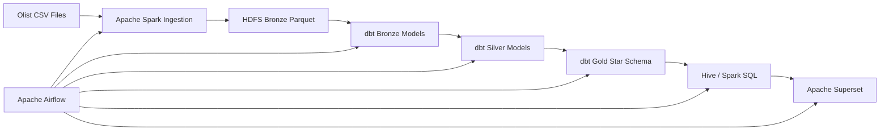
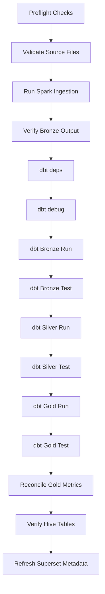

# Big Data Analytics Pipeline - Design Document

## Project Overview

This project implements an end-to-end Big Data Analytics Pipeline using Apache Spark, Hadoop HDFS, Apache Hive, Apache Superset, Apache Airflow, and dbt.

The objective is to transform raw e-commerce data into reliable analytical datasets, organize them through a dimensional warehouse, automate the data workflow, and provide business insights through interactive dashboards.

The project is organized into three phases:

- **Phase 1:** Data ingestion, Spark processing, Parquet conversion, HDFS storage, Hive integration, and Superset visualization.
- **Phase 2:** Data quality analysis, ETL design, star schema modeling, fact and dimension tables, and business analytics.
- **Phase 3:** Airflow orchestration, dbt transformations, Bronze-Silver-Gold Medallion Architecture, data quality testing, and automated pipeline execution.

The existing Spark-based Phase 2 warehouse remains available for comparison, while the dbt Gold models represent the Phase 3 transformation path.

---

# System Architecture

```text
          Olist CSV Dataset
                 │
                 ▼
           Apache Spark
        Ingestion and ETL
                 │
                 ▼
      HDFS Bronze Parquet Layer
                 │
                 ▼
            dbt Bronze
       Source-Aligned Models
                 │
                 ▼
            dbt Silver
     Cleaned Business Entities
                 │
                 ▼
             dbt Gold
       Star Schema and Marts
                 │
                 ▼
      Hive / Spark ThriftServer
                 │
                 ▼
         Apache Superset
      Business Intelligence
```

Apache Airflow orchestrates the complete sequence, including readiness checks, Spark ingestion, dbt transformations, validation, reconciliation, and Superset metadata refresh.

---

# Architecture Layers

## 1. Data Source Layer

The source layer contains the Olist Brazilian E-Commerce CSV datasets.

Main entities include:

- Orders
- Order items
- Payments
- Reviews
- Customers
- Sellers
- Products
- Product category translations
- Geolocation

Raw files are stored under:

```text
data/raw
```

Inside Docker containers, the project is mounted under:

```text
/app
```

---

## 2. Processing Layer

Apache Spark performs the initial distributed processing.

Responsibilities include:

- Reading CSV files
- Inferring schemas
- Applying safe type detection
- Converting data to Parquet
- Writing datasets to HDFS
- Supporting the original Phase 2 warehouse builders

Phase 1 Parquet outputs are written to:

```text
hdfs://namenode:9000/olist/parquet
```

---

## 3. Medallion Transformation Layer

Phase 3 introduces a Medallion Architecture.

### Bronze Layer

The Bronze layer preserves source-aligned datasets with minimal transformation.

Responsibilities:

- Preserve source grain
- Standardize column names
- Apply safe basic casts
- Keep data traceable to the source
- Avoid business joins and KPI calculations

### Silver Layer

The Silver layer contains cleaned and reusable business entities.

Responsibilities:

- Explicit data typing
- Deduplication
- Business-key enforcement
- Payment aggregation
- Review normalization
- Order-item value calculations
- Data quality validation

### Gold Layer

The Gold layer contains dimensional models used by analytics and reporting.

Gold models include:

- `fact_orders`
- `dim_customers`
- `dim_products`
- `dim_sellers`
- `dim_date`

The Gold layer is designed for Apache Superset and business-oriented SQL queries.

---

## 4. Storage Layer

Hadoop HDFS provides distributed storage for Parquet datasets.

Main storage locations:

```text
hdfs://namenode:9000/olist/parquet
```

```text
hdfs://namenode:9000/olist/warehouse
```

HDFS provides:

- Distributed storage
- Fault tolerance
- Scalability
- Shared access between analytical services

---

## 5. Query Layer

Apache Hive and Spark ThriftServer provide SQL access to the analytical datasets.

Spark ThriftServer runs against:

```text
spark://spark-master:7077
```

External SQL clients such as Apache Superset connect through the Thrift interface.

This layer allows analytical querying without copying the underlying Parquet data.

---

## 6. Orchestration Layer

Apache Airflow controls pipeline execution.

Airflow responsibilities include:

- Scheduling
- Dependency management
- Retry handling
- Task monitoring
- Failure visibility
- Pipeline reruns
- Service-readiness checks
- Reconciliation
- Superset metadata refresh

The Airflow stack uses:

- Airflow Webserver
- Airflow Scheduler
- Airflow Triggerer
- LocalExecutor
- PostgreSQL metadata database
- Airflow initialization service

---

## 7. Visualization Layer

Apache Superset provides the business intelligence interface.

It supports:

- KPI cards
- Distribution charts
- Revenue analysis
- Order-status analysis
- Customer review analysis
- Interactive dashboards

---

# ETL and ELT Design

## Phase 1 and Phase 2 ETL

The original pipeline follows an ETL workflow.

### Extract

Raw CSV files are read into Spark DataFrames.

### Transform

Spark performs:

- Schema inference
- Type conversion
- Record cleaning
- Dataset joins
- Payment aggregation
- Fact and dimension creation
- Parquet conversion

### Load

Processed datasets are written to HDFS and exposed through Hive.

---

## Phase 3 Transformation Model

Phase 3 separates ingestion from warehouse transformation.

Spark remains responsible for ingestion and Parquet generation.

dbt becomes responsible for:

- Bronze source models
- Silver cleaning and business logic
- Gold dimensional models
- Tests
- Documentation
- Lineage

This design is closer to an ELT-style analytical workflow because transformed source data is exposed through the query engine and then modeled with dbt SQL.

---

# Medallion Architecture



## Medallion Benefits

- Clear data boundaries
- Modular transformations
- Better lineage
- Easier testing
- Improved maintainability
- Fault isolation
- Easier debugging
- Reusable business entities
- Separation of ingestion and modeling

---

# Airflow Core Components

- **DAG:** Defines workflow structure, dependencies, and scheduling.
- **Scheduler:** Evaluates DAGs and queues runnable tasks.
- **Webserver:** Provides the Airflow user interface and API.
- **Executor:** Defines how tasks are executed; this project uses `LocalExecutor`.
- **Metadata Database:** Stores task state, DAG runs, connections, variables, and history.
- **Operator:** Defines how a task executes, such as Python or Bash.
- **Task:** Represents one unit of work inside a DAG.
- **Triggerer:** Handles asynchronous and deferred tasks.
- **XCom:** Passes small metadata values between tasks.
- **Connection:** Stores external system endpoints and credentials outside DAG code.

---

# Airflow DAG Design

The main DAG is:

```text
olist_medallion_pipeline
```

## DAG Flow



## Task Boundaries

### Preflight Tasks

Validate that required services are reachable:

- HDFS
- Spark Master
- Spark ThriftServer
- Superset
- Source files

### Spark Task

Runs the existing Spark ingestion job.

This task remains separate because Spark manages distributed file ingestion and Parquet creation.

### dbt Tasks

dbt tasks run through explicit Bash commands:

- `dbt deps`
- `dbt debug`
- `dbt run`
- `dbt test`

Bronze, Silver, and Gold are executed as separate stages so failures can be isolated.

### Validation Tasks

Validation tasks check:

- Dataset counts
- Gold fact row counts
- Revenue reconciliation
- Hive table availability
- dbt test results

### Publication Task

The final task refreshes Superset metadata after successful warehouse validation.

---

# Airflow Runtime Configuration

The DAG uses:

- `catchup=False`
- `max_active_runs=1`
- Two retries
- Five-minute retry delay
- Explicit task timeouts
- Small XCom payloads only

XCom values are limited to metadata such as:

- Row counts
- Run identifiers
- Validation status
- Dataset counts

DataFrames and large files are never stored in XCom.

---

# dbt Project Design

The dbt project is located under:

```text
dbt/
```

Main directories:

```text
dbt/models/bronze
dbt/models/silver
dbt/models/gold
dbt/macros
dbt/tests
dbt/seeds
dbt/snapshots
```

## dbt Sources

Bronze sources are declared in:

```text
dbt/models/bronze/sources.yml
```

Sources include:

- Orders
- Order items
- Payments
- Reviews
- Customers
- Sellers
- Products
- Category translations

## dbt References

Models use `ref()` to create explicit dependencies.

Example:

```text
Bronze → Silver → Gold
```

This allows dbt to determine execution order and generate lineage.

## dbt Tests

The project uses:

- `not_null`
- `unique`
- `relationships`
- `accepted_values`
- Positive numeric checks
- Composite-key checks
- Reconciliation checks

Custom tests are defined in:

```text
dbt/macros/generic_tests.sql
```

---

# Data Warehouse Design

The warehouse uses a Star Schema.

## Fact Table

### `fact_orders`

The grain is:

```text
one row per order_id + order_item_id
```

Important keys:

- `order_id`
- `order_item_id`
- `customer_id`
- `seller_id`
- `product_id`
- `date_key`

Important measures:

- `price`
- `freight_value`
- `item_gross_value`
- `order_items_gross_total`
- `order_payment_value`
- `allocated_payment_value`
- `review_score`
- `primary_payment_installments`

Important dimensions and groupings:

- `order_status`
- `primary_payment_type`

---

## Payment Allocation

Payments are first aggregated at order level.

```text
item_gross_value = price + freight_value
```

```text
allocated_payment_value =
    order_payment_value
    × item_gross_value
    ÷ order_items_gross_total
```

This design prevents payment values from being duplicated when orders contain multiple items or multiple payment rows.

---

## Dimension Tables

### `dim_customers`

Contains customer identity and geographic information.

### `dim_products`

Contains product category, dimensions, and weight information.

### `dim_sellers`

Contains seller identity and location information.

### `dim_date`

Contains reusable time attributes including:

- Date key
- Full date
- Year
- Quarter
- Month
- Month name
- Day
- Day of week
- Day name
- Weekend indicator

---

# Business Questions

The warehouse supports questions such as:

| Business Question | Fact Table | Main Dimensions |
|---|---|---|
| Monthly revenue | `fact_orders` | `dim_date` |
| Revenue by category | `fact_orders` | `dim_products` |
| Top-performing sellers | `fact_orders` | `dim_sellers` |
| Sales by customer state | `fact_orders` | `dim_customers` |
| Payment method trends | `fact_orders` | `primary_payment_type` |
| Average review by category | `fact_orders` | `dim_products` |
| Revenue by order status | `fact_orders` | `order_status` |

---

# Dashboard Design

The Apache Superset dashboard contains:

## KPI Cards

- Total Sales
- Total Orders
- Total Customers
- Average Review Score

## Visualizations

- Payment Type Distribution
- Order Status Distribution
- Revenue by Order Status
- Review Score Distribution

Recommended Phase 3 metrics:

```text
SUM(allocated_payment_value)
```

```text
COUNT(DISTINCT order_id)
```

```text
COUNT(DISTINCT customer_id)
```

```text
AVG(review_score)
```

---

# Design Decisions

The following choices were made:

- Spark for distributed ingestion
- Parquet for columnar storage
- HDFS for distributed storage
- Hive and Spark ThriftServer for SQL access
- dbt for modular analytical transformations
- Airflow for orchestration and monitoring
- PostgreSQL for Airflow metadata
- Star Schema for reporting
- Superset for business intelligence
- Environment variables for credentials
- Docker network `bigdata-net` for service communication

---

# Challenges

## Spark and dbt Interoperability

dbt must query data exposed through Spark ThriftServer while Spark writes Parquet to HDFS.

## Adapter Selection

The dbt adapter must remain compatible with the existing Spark and Hive query layer.

## Payment Multiplication

Joining order items directly with payment rows can duplicate revenue. Payments therefore require aggregation before fact-table joins.

## Fact Grain

The order-item grain must remain stable at one row per `order_id` and `order_item_id`.

## Docker Networking

Airflow containers must reach Spark, HDFS, Superset, PostgreSQL, and ThriftServer through the shared network.

## Idempotency

Spark writes, dbt models, reconciliation outputs, and metadata refresh operations must be safe to rerun.

## Service Readiness

The pipeline must fail early when required services are unavailable.

## Docker Platform Compatibility

ARM64 and AMD64 differences can affect image support and dependency installation.

## Hive Metastore Persistence

Hive metadata must remain available across ThriftServer restarts.

---

# Validation Status

Completed validations include:

- Python compilation for processing and Airflow code
- Git diff validation
- Merge-conflict marker checks
- DAG unit-test execution
- Two DAG tests passed
- Four tests were skipped because full Airflow runtime dependencies were unavailable locally

Full end-to-end runtime validation requires all Docker services, Airflow, Spark, HDFS, Hive, dbt, and Superset to be running together.

---

# Future Improvements

- Incremental dbt models
- Airflow dataset-aware scheduling
- Additional dimensions
- Slowly Changing Dimensions
- Kafka streaming
- Machine-learning models
- Customer segmentation
- Sales forecasting
- Cloud deployment
- Centralized monitoring
- Alerting and notifications