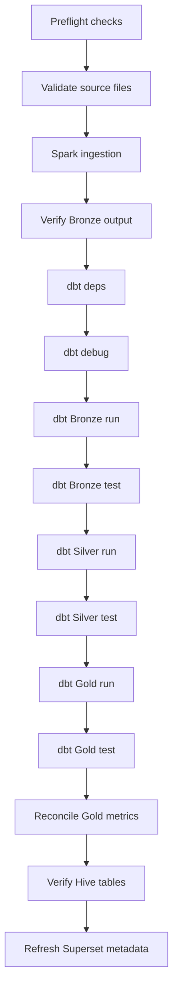

# Big Data Analytics Pipeline - Design Document

## Project Overview

This project implements an end-to-end Big Data Analytics Pipeline using Apache Spark, Hadoop HDFS, Apache Hive, and Apache Superset.

The objective is to transform raw e-commerce data into an analytical data warehouse and provide business insights through interactive dashboards.

The first two phases are complete, and Phase 3 is now being implemented:

- **Phase 1:** Data ingestion, transformation, storage, and visualization.
- **Phase 2:** Data warehouse design, ETL documentation, star schema modeling, and business analytics.
- **Phase 3:** Airflow orchestration, dbt transformation scaffolding, and a Medallion Architecture migration.

---

# System Architecture

```
          Olist CSV Dataset
                 │
                 ▼
           Apache Spark
      (Extract & Transform)
                 │
                 ▼
        Apache Parquet Files
                 │
                 ▼
           Hadoop HDFS
      (Distributed Storage)
                 │
                 ▼
            Apache Hive
      (Metadata & SQL Layer)
                 │
                 ▼
         Apache Superset
    (Business Intelligence)
```

---

# Architecture Layers

The project follows a layered architecture.

## 1. Data Source Layer

- Olist Brazilian E-Commerce Dataset
- CSV files

---

## 2. Processing Layer

Apache Spark performs:

- Reading CSV files
- Schema inference
- Data cleaning
- Data transformation
- Parquet conversion

---

## 3. Storage Layer

Hadoop HDFS stores all processed datasets in distributed storage.

Phase 1 writes curated Parquet datasets to the configured HDFS Parquet URI, and Phase 2 writes the warehouse fact and dimension tables to the configured HDFS warehouse URI. Raw CSV inputs remain mounted locally inside the container filesystem.

Benefits include:

- Fault tolerance
- Scalability
- High availability

---

## 4. Query Layer

Apache Hive provides SQL access through external tables built on Parquet files.

No data duplication is required because Hive references the existing files.

---

## 5. Visualization Layer

Apache Superset connects directly to Hive and provides:

- KPI Cards
- Business Charts
- Interactive Dashboards

---

# ETL Design

The project follows a traditional **ETL (Extract, Transform, Load)** workflow.

## Extract

Raw CSV files are loaded into Apache Spark DataFrames.

## Transform

Data is processed by:

- Cleaning records
- Selecting required columns
- Joining datasets
- Building analytical tables
- Converting CSV to Parquet

## Load

The transformed datasets are:

- Stored in Hadoop HDFS
- Registered as Hive external tables
- Queried from Apache Superset

---

# ETL vs ELT

This project uses the ETL approach because all transformations are completed before loading the data into the analytical environment.

Compared to ELT, ETL reduces dashboard query complexity and improves analytical performance.

The project documentation also discusses modern ELT architectures and dbt as part of the active Phase 3 transformation plan. Apache Airflow is now being implemented as the orchestration layer for Phase 3.

## Phase 3 Foundation

Phase 3 is now being implemented around a Medallion Architecture. Airflow and dbt are part of the active Phase 3 buildout, while the existing Phase 2 warehouse scripts remain available during the migration so the current warehouse can keep running unchanged.

Phase 3.5 rebuilds the Phase 2 star schema as dbt Gold models while keeping the Spark builders available for comparison until migration is complete.

Phase 3.7 connects Airflow to the Spark ingestion job, dbt `deps`/`debug`/`run`/`test`, preflight readiness checks, idempotent Superset refresh, and reconciliation artifacts stored under `reports/phase3/runs/`.

## Medallion Architecture


Bronze is source-aligned and minimally processed, Silver is cleaned and business-ready, and Gold contains facts, dimensions, KPIs, and reporting marts.

The medallion layout provides:

- clear data contracts
- easier testing
- modular transformations
- lineage
- maintainability
- fault isolation

---

## Airflow DAG Flow



## Airflow Core Components

- **DAG:** A DAG is the directed acyclic graph that defines workflow order, dependencies, and scheduling for the pipeline.
- **Scheduler:** The scheduler parses DAG files, evaluates dependencies, and queues runnable task instances.
- **Webserver:** The webserver serves the UI and API for browsing DAGs, inspecting runs, and operating the orchestration environment.
- **Executor:** The executor decides how tasks are dispatched; `LocalExecutor` runs them on the local Airflow host with parallel worker slots.
- **Metadata Database:** The metadata database stores DAG definitions, task state, run history, connections, variables, and other Airflow metadata.
- **Operator:** An operator is a reusable execution template, such as `PythonOperator` or `BashOperator`, that defines how a task runs.
- **Task:** A task is one unit of work in the DAG, such as source validation, Spark ingestion, dbt execution, or metadata refresh.
- **Triggerer:** The triggerer manages deferred tasks and asynchronous triggers without holding worker slots open.
- **XCom:** XCom is Airflow's lightweight cross-communication mechanism for passing small metadata values between tasks.
- **Connection:** A connection is a named credential or endpoint reference stored outside the DAG code and used by operators at runtime.

## Airflow DAG Walkthrough

- **Task sequence:** The DAG runs preflight checks first, then validates source CSV files, ingests Bronze Parquet, runs dbt Bronze/Silver/Gold, reconciles the Gold outputs, verifies Hive tables, and finally refreshes Superset metadata.
- **Task boundaries:** Spark ingestion stays in a Python boundary around the existing Spark job, dbt steps stay in Bash boundaries, and Superset refresh stays in a small HTTP boundary so each external system is isolated.
- **Operator choices:** `PythonOperator` handles lightweight checks and Python-based wrappers, while `BashOperator` keeps dbt commands explicit and easy to rerun.
- **Retries:** The DAG retries tasks twice with a five-minute delay, which helps transient HDFS, Spark, Hive, or HTTP issues recover without manual intervention.
- **Timeouts:** Long-running Spark and dbt tasks use explicit execution timeouts, while validation and refresh tasks stay short-lived.
- **Resources:** Spark ingestion targets the configured Spark master, dbt uses the configured ThriftServer connection, and validation tasks return only small metadata values through XCom.
- **Rerun behavior:** Every task is designed to be safe to rerun, and reconciliation artifacts are keyed by the Airflow run identifier so a failed run can be repeated without overwriting unrelated results.

## dbt Project

- **Sources:** Bronze source declarations in `dbt/models/bronze/sources.yml` map the Spark-produced Parquet datasets into dbt sources.
- **Refs:** `ref()` links Bronze, Silver, and Gold models together so lineage is explicit and dbt can build models in dependency order.
- **Models:** Bronze models are source-aligned views, Silver models are cleaned and typed tables, and Gold models rebuild the dimensional warehouse.
- **Tests:** Built-in and custom tests enforce uniqueness, relationships, accepted values, positive-value constraints, and reconciliation checks.
- **Macros:** Custom macros in `dbt/macros/generic_tests.sql` handle reusable quality checks that are not covered cleanly by built-in tests.
- **Documentation:** Model and column descriptions are stored in dbt schema YAML files so the warehouse stays self-describing.
- **Lineage:** dbt captures lineage automatically through source declarations and `ref()` usage, which makes the transformation graph easier to reason about.

## Bronze, Silver, and Gold

- **Bronze:** Bronze keeps source-aligned Parquet data with only safe casts and naming alignment, so the raw business meaning is preserved.
- **Silver:** Silver cleans, types, and deduplicates records into reusable business-ready entities and aggregates.
- **Gold:** Gold turns Silver into reporting marts, including the order-item fact table and the dimensional model used by Superset.

## Why the Spark Star Schema Moved to dbt

The original Spark-built star schema worked, but the migration to dbt Gold models gives the warehouse clearer lineage, reusable SQL models, layered testing, and a more maintainable transformation boundary.

dbt also makes it easier to express the Bronze/Silver/Gold contracts separately from the Spark ingestion code, so the ingestion job can stay focused on loading data while dbt owns warehouse shaping and validation.

## Benefits

- modularity
- lineage
- testing
- maintainability
- reusable SQL models
- separation of concerns
- data quality boundaries

## Challenges

- Spark/HDFS/dbt interoperability required the same data layout to be readable by both Spark jobs and the dbt query engine.
- Query-engine and adapter selection had to match the available Spark ThriftServer/Hive path rather than a new warehouse engine.
- Payment row multiplication had to be removed by aggregating payments before joining to order items.
- Fact grain preservation had to stay at one row per order item so the Gold fact did not duplicate revenue.
- Airflow container access to Spark had to be configured through the shared Docker network and external service endpoints.
- Idempotency mattered for reruns, so tasks, output paths, and Superset refresh behavior were written to be repeatable.
- Service readiness checks were needed before orchestration started so failures happened early and visibly.
- ARM64 and AMD64 Docker image differences affected image availability and dependency resolution.
- Hive metastore persistence matters because warehouse tables and ThriftServer metadata need stable state across container restarts.

---

# Data Warehouse Design

A Star Schema was implemented for analytical reporting.

The Spark-built Phase 2 warehouse remains available for comparison, but the dbt Gold models are now the primary Phase 3 transformation path.

## Fact Table

**fact_orders**

Order-item fact table with one row per `order_id` + `order_item_id`.

Measures:

- item_gross_value
- order_items_gross_total
- order_payment_value
- allocated_payment_value
- price
- freight_value
- review_score
- primary_payment_installments

Keys:

- order_id
- order_item_id
- customer_id
- seller_id
- product_id
- date_key

Primary grouping column:

- primary_payment_type

Order-level payments are aggregated before joining to order items, and `allocated_payment_value` is allocated proportionally from each item's gross value so revenue is not duplicated across payment rows.

---

## Dimension Tables

### dim_customers

Customer information.

### dim_products

Product information.

### dim_sellers

Seller information.

### dim_date

Date dimension used for time-based analysis.

---

# Business Questions

The warehouse was designed to answer common analytical questions such as:

- What is the total allocated sales revenue?
- How many distinct orders exist?
- How many unique customers are there?
- Which primary payment methods are most popular?
- Which order statuses occur most frequently?
- What is the average customer review score?

---

# Dashboard Design

Apache Superset was used to create an interactive dashboard.

## KPI Cards

- Total Sales (`sum(allocated_payment_value)`)
- Total Orders (`count(distinct order_id)`)
- Total Customers
- Average Review Score (`avg(review_score)`)

## Visualizations

- Payment Type Distribution by `primary_payment_type`
- Order Status Distribution
- Revenue by Order Status using `allocated_payment_value`
- Review Score Distribution

These visualizations provide a concise overview of marketplace performance and support business decision-making.

---

# Design Decisions

The following design choices were made during implementation:

- Apache Spark for distributed ETL processing
- Apache Parquet for optimized storage
- Hadoop HDFS for distributed file storage
- Hive External Tables to avoid data duplication
- Star Schema for analytical queries
- Apache Superset for dashboard visualization

These decisions improve scalability, maintainability, and query performance.

---

# Future Improvements

Possible future enhancements include:

- Incremental data loading
- Additional dimension tables
- Machine Learning integration
- Customer segmentation
- Sales forecasting
- Real-time streaming with Apache Kafka
- Cloud deployment on AWS or Azure
