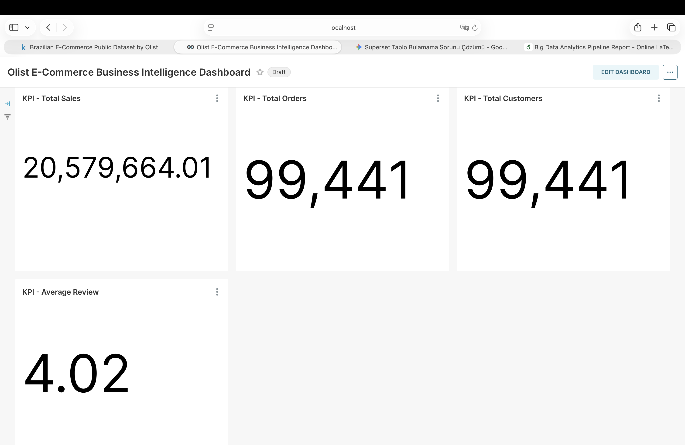
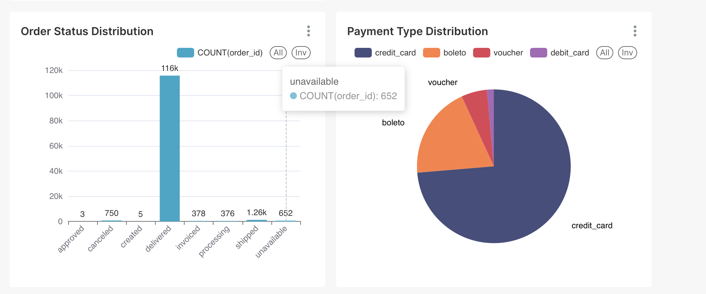
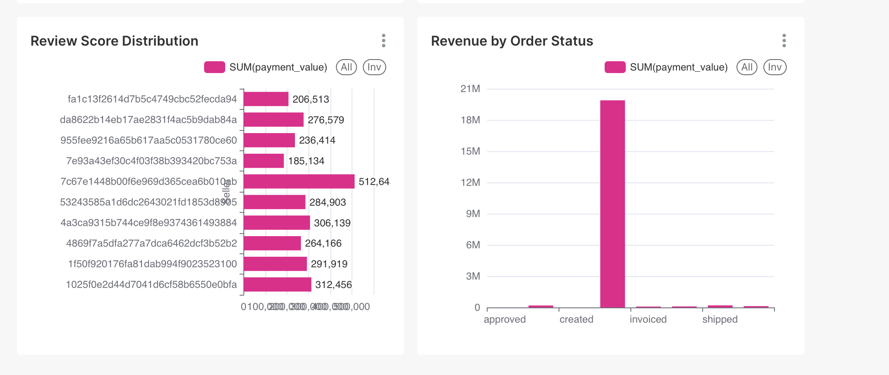

# 🚀 Big Data Analytics Pipeline with Apache Spark, Hadoop HDFS, Apache Hive & Apache Superset


An end-to-end Big Data Analytics Pipeline built using **Apache Spark**, **Hadoop HDFS**, **Apache Hive**, and **Apache Superset** to process, store, query, and visualize the **Olist Brazilian E-Commerce Dataset**.

The project demonstrates a complete modern data engineering workflow, from raw CSV ingestion to analytical warehouse modeling and interactive business intelligence dashboards.

---

# 📊 Dashboard

> Interactive dashboard built with Apache Superset.


---

# 📌 Project Overview

This project analyzes approximately **100,000 Brazilian e-commerce orders** using distributed data processing and business intelligence technologies.

The project is organized into phases.

## Phase 1 — Data Ingestion and Processing

Phase 1 focuses on building the initial big data pipeline.

Implemented tasks include:

- Reading raw CSV datasets using Apache Spark
- Inferring dataset schemas
- Transforming CSV files into Apache Parquet format
- Storing curated Parquet datasets in Hadoop HDFS
- Creating Hive external tables
- Connecting Apache Superset to Hive
- Building an interactive business dashboard

Raw CSV files are mounted locally under:

```text
/app/data/raw
```

Curated Phase 1 Parquet datasets are stored in HDFS under:

```text
hdfs://namenode:9000/olist/parquet
```

## Phase 2 — Data Warehouse and Business Analytics

Phase 2 extends the pipeline with a star-schema analytical warehouse.

Implemented tasks include:

- Data quality assessment
- ETL architecture design
- ETL vs ELT comparison
- Discussion of dbt as an architectural alternative
- Star schema design
- Fact and dimension modeling
- Business-question mapping
- Business analytics dashboard development
- Technical documentation

The Phase 2 warehouse stores fact and dimension tables under:

```text
hdfs://namenode:9000/olist/warehouse
```

The analytical model is built around an order-item fact table.

## Phase 3 — Planned Reconstruction

Phase 3 is planned as a future extension.

Planned work includes:

- Apache Airflow for scheduling, orchestration, and monitoring
- dbt for modular SQL transformations and testing
- Bronze, Silver, and Gold Medallion Architecture layers
- Incremental data loading
- Automated data quality checks
- Improved observability and pipeline monitoring

Airflow and dbt are not currently implemented.

---

# 🏗️ System Architecture

```text
          Olist CSV Dataset
                 │
                 ▼
           Apache Spark
      CSV Ingestion and ETL
                 │
                 ▼
         Apache Parquet
                 │
                 ▼
            Hadoop HDFS
       Distributed Storage
                 │
                 ▼
            Apache Hive
       Metadata and SQL Layer
                 │
                 ▼
         Apache Superset
      Business Intelligence
```

---

# 🛠️ Technologies

- Apache Spark
- Hadoop HDFS
- Apache Hive
- Apache Superset
- Docker
- Python
- SQL
- Apache Parquet

---

# 📂 Dataset

The project uses the **Brazilian E-Commerce Public Dataset by Olist**.

Dataset source:

https://www.kaggle.com/datasets/olistbr/brazilian-ecommerce

The source contains approximately:

- 99,441 orders
- 99,000+ customers
- 112,000+ order items
- 104,000+ payment records
- 100,000+ reviews
- 33,000+ products
- 3,000+ sellers
- 1 million geolocation records

Main source files:

| File | Approximate Rows | Description |
|---|---:|---|
| `olist_orders_dataset.csv` | 100k | Order lifecycle, timestamps, and status |
| `olist_order_items_dataset.csv` | 112k | Product, seller, price, and freight information |
| `olist_order_payments_dataset.csv` | 104k | Payment type, installments, and payment value |
| `olist_order_reviews_dataset.csv` | 100k | Review scores and customer comments |
| `olist_customers_dataset.csv` | 100k | Customer city, state, and ZIP code |
| `olist_sellers_dataset.csv` | 3k | Seller city, state, and ZIP code |
| `olist_products_dataset.csv` | 33k | Product category, dimensions, and weight |
| `olist_geolocation_dataset.csv` | 1M | ZIP code, latitude, and longitude |
| `product_category_name_translation.csv` | 71 | Portuguese-to-English category translation |

---

# ⚙️ Data Processing Pipeline

## Step 1 — Data Ingestion

Apache Spark reads the raw CSV files from the mounted local directory.

Local input files are converted to valid local URIs using `Path.resolve().as_uri()`.

Spark schema inference is enabled so numeric, date, and string fields are represented using appropriate data types.

## Step 2 — Data Transformation

Spark transforms the datasets into Apache Parquet format.

Advantages include:

- Column-oriented storage
- Faster analytical queries
- Better compression
- Reduced storage usage
- Improved compatibility with analytical engines

## Step 3 — Distributed Storage

Processed Parquet datasets are written to Hadoop HDFS.

Phase 1 datasets:

```text
hdfs://namenode:9000/olist/parquet
```

Phase 2 warehouse tables:

```text
hdfs://namenode:9000/olist/warehouse
```

## Step 4 — Query Layer

Apache Hive provides SQL access to the Parquet datasets.

Hive external tables reference the underlying Parquet files without duplicating the data.

## Step 5 — Business Intelligence

Apache Superset connects to Hive through Spark ThriftServer and provides interactive KPI cards and analytical charts.

---

# 🏛️ Data Warehouse Design

The analytical warehouse follows a **Star Schema** architecture.

## Fact Table

### `fact_orders`

`fact_orders` is an **order-item fact table**.

Its grain is:

```text
one row per order_id + order_item_id
```

This grain supports product-, seller-, customer-, order-, and payment-level analysis while preventing duplicate revenue caused by joining multiple payment rows directly to multiple order items.

Important measures and derived columns include:

- `price`
- `freight_value`
- `item_gross_value`
- `order_items_gross_total`
- `order_payment_value`
- `allocated_payment_value`
- `review_score`
- `primary_payment_installments`

Important grouping columns include:

- `order_status`
- `primary_payment_type`

## Payment Allocation Logic

Payment records are first aggregated at order level before being joined to order items.

Order-level payment value is allocated proportionally to each item:

```text
item_gross_value = price + freight_value
```

```text
allocated_payment_value =
    order_payment_value
    × item_gross_value
    ÷ order_items_gross_total
```

This prevents revenue from being multiplied when an order contains multiple items or multiple payment records.

## Dimension Tables

### `dim_customers`

Contains customer attributes such as:

- `customer_id`
- `customer_unique_id`
- `customer_city`
- `customer_state`
- `customer_zip_code_prefix`

### `dim_products`

Contains product attributes such as:

- `product_id`
- `product_category_name`
- `product_weight_g`
- Product dimensions

### `dim_sellers`

Contains seller attributes such as:

- `seller_id`
- `seller_city`
- `seller_state`
- `seller_zip_code_prefix`

### `dim_date`

Contains date attributes such as:

- `date_key`
- `date`
- `year`
- `month`
- `day`

Dimension builders preserve one row per dimension key using `dropDuplicates`.

---

# 🔄 ETL Architecture

The project follows a traditional **ETL** workflow.

## Extract

- Read raw CSV files using Apache Spark
- Load source datasets into Spark DataFrames

## Transform

- Infer schemas
- Cast numeric columns
- Select required attributes
- Deduplicate dimension entities
- Aggregate payment records
- Join source datasets
- Build fact and dimension tables
- Convert results into Parquet

## Load

- Write curated datasets to Hadoop HDFS
- Store warehouse tables in HDFS
- Register tables through Hive
- Query data through Apache Superset

## ETL vs ELT

ETL was selected because Spark performs distributed transformations before data is exposed to the analytical layer.

In an ELT architecture, raw data would first be loaded into the warehouse and transformed later using SQL.

dbt is discussed as a possible future transformation framework because it supports:

- Modular SQL models
- Testing
- Documentation
- Lineage
- Version-controlled transformations

dbt is not currently implemented in this repository.

---

# 💼 Business Questions

The analytical warehouse supports the following business questions:

| Business Question | Fact Table | Main Dimensions |
|---|---|---|
| Monthly revenue | `fact_orders` | `dim_date` |
| Revenue by product category | `fact_orders` | `dim_products` |
| Top-performing sellers | `fact_orders` | `dim_sellers` |
| Sales by customer state | `fact_orders` | `dim_customers` |
| Payment method trends | `fact_orders` | `primary_payment_type` |
| Average review score by category | `fact_orders` | `dim_products` |
| Revenue by order status | `fact_orders` | `order_status` |

Average delivery time by state is identified as a future extension because the current fact table does not include all delivery-duration fields required for that analysis.

---

# 📈 Dashboard Metrics

The Apache Superset dashboard contains KPI cards and business-oriented visualizations.

## KPIs

- Total Sales  
  `SUM(allocated_payment_value)`

- Total Orders  
  `COUNT(DISTINCT order_id)`

- Total Customers  
  `COUNT(DISTINCT customer_id)`

- Average Review Score  
  `AVG(review_score)`

## Charts

- Payment Type Distribution using `primary_payment_type`
- Order Status Distribution
- Revenue by Order Status using `allocated_payment_value`
- Review Score Distribution

These visualizations provide a concise overview of marketplace performance, payment behavior, order fulfillment, and customer satisfaction.

---

# 📸 Screenshots

## Apache Spark


## Hadoop HDFS


## Apache Superset Dashboard


## Phase 2 Dashboard







---

# 📁 Project Structure

```text
BigData-Pipeline-Project/
│
├── docker/
│   ├── Dockerfile.dev
│   ├── Dockerfile.superset
│   ├── docker-compose-dev.yml
│   ├── docker-compose-hdfs.yml
│   ├── docker-compose-minio.yml
│   ├── docker-compose-spark.yml
│   └── docker-compose-superset.yml
│
├── processing/
│   ├── __init__.py
│   ├── analysis.py
│   ├── config.py
│   ├── logger.py
│   ├── spark_session.py
│   ├── quality/
│   │   └── __init__.py
│   ├── utils/
│   │   └── __init__.py
│   └── warehouse/
│       ├── __init__.py
│       ├── build_dim_customers.py
│       ├── build_dim_date.py
│       ├── build_dim_products.py
│       ├── build_dim_sellers.py
│       └── build_fact_orders.py
│
├── reports/
│   ├── Big_Data_Analytics_Pipeline_Report.pdf
│   └── REPORT.md
│
├── screenshots/
│   ├── dashboard.png
│   ├── dashboard_phase2_1.png
│   ├── dashboard_phase2_2.png
│   ├── dashboard_phase2_3.png
│   ├── hdfs.png
│   └── spark.png
│
├── scripts/
│   ├── download_dataset.py
│   ├── setup_network.ps1
│   └── setup_network.sh
│
├── visualization/
│   └── register_tables.py
│
├── DESIGN.md
├── README.md
└── .gitignore
```

---

# ▶️ Running the Project

Clone the repository:

```bash
git clone https://github.com/BeyzanurArslaan/BigData-Pipeline-Project.git
cd BigData-Pipeline-Project
```

Start Hadoop:

```bash
docker compose -f docker/docker-compose-hdfs.yml up -d
```

Start Spark:

```bash
docker compose -f docker/docker-compose-spark.yml up -d
```

Start Apache Superset:

```bash
docker compose -f docker/docker-compose-superset.yml up -d
```

Check running services:

```bash
docker ps
```

Open the interfaces:

| Service | URL |
|---|---|
| HDFS NameNode | http://localhost:9870 |
| Spark Master | http://localhost:8080 |
| Apache Superset | http://localhost:8088 |

## Superset Local Demo Credentials

```text
Username: admin
Password: admin
```

These credentials are for local demonstrations only.

Use environment variables and strong, unique credentials for non-local deployments.

---

# ▶️ Running Spark Jobs

Enter the Spark container:

```bash
docker exec -it spark-master bash
```

Move to the mounted project directory:

```bash
cd /app
```

Run Phase 1 ingestion:

```bash
PYTHONPATH=/app \
/spark/bin/spark-submit processing/analysis.py
```

Run warehouse builders:

```bash
PYTHONPATH=/app \
/spark/bin/spark-submit processing/warehouse/build_fact_orders.py
```

```bash
PYTHONPATH=/app \
/spark/bin/spark-submit processing/warehouse/build_dim_customers.py
```

```bash
PYTHONPATH=/app \
/spark/bin/spark-submit processing/warehouse/build_dim_products.py
```

```bash
PYTHONPATH=/app \
/spark/bin/spark-submit processing/warehouse/build_dim_sellers.py
```

```bash
PYTHONPATH=/app \
/spark/bin/spark-submit processing/warehouse/build_dim_date.py
```

---

# ✅ Project Outcomes

Successfully implemented:

- Apache Spark ETL pipeline
- CSV-to-Parquet transformation
- Hadoop HDFS distributed storage
- Apache Hive SQL integration
- Star schema data warehouse
- Order-item fact table
- Fact and dimension modeling
- Payment aggregation and allocation
- Business-question mapping
- Interactive Apache Superset dashboard
- End-to-end big data analytics workflow

---

# 📄 Documentation

The repository includes:

- Final project report
- `README.md`
- `DESIGN.md`
- Apache Superset dashboard screenshots
- Spark ingestion scripts
- Spark warehouse scripts

---

# 👩‍💻 Author

**Beyzanur Arslan**

Software Engineering Student

- GitHub: https://github.com/BeyzanurArslaan
- LinkedIn: [Beyzanur Arslan](https://www.linkedin.com/in/beyzanur-arslan-ba18b832a/)