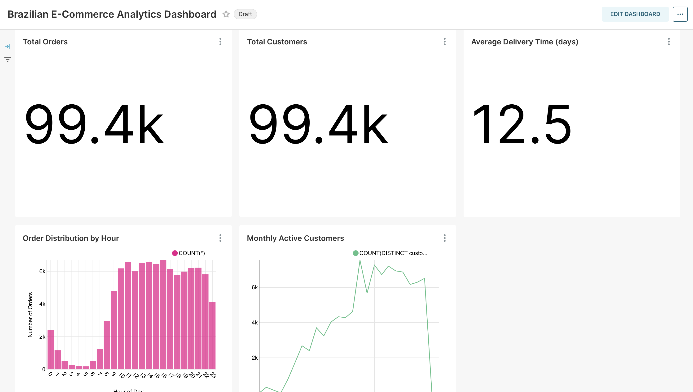
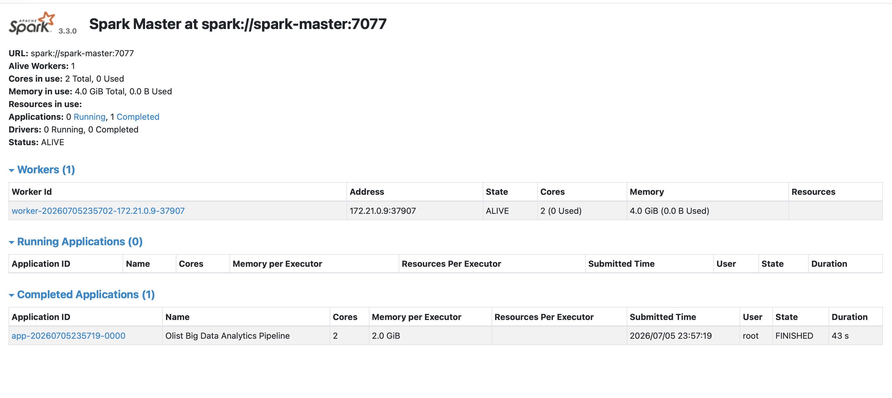
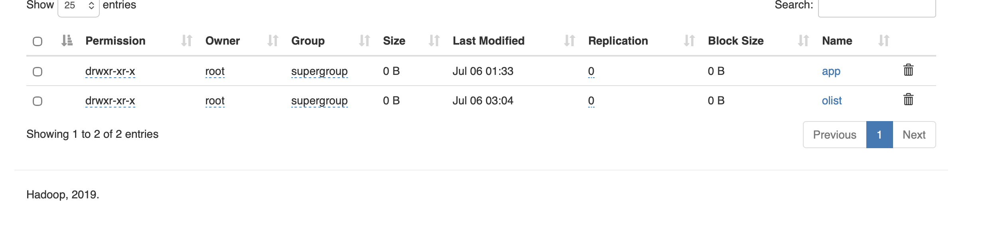

# 🚀 Big Data Analytics Pipeline with Apache Spark, Hadoop HDFS & Apache Superset


An end-to-end Big Data Analytics Pipeline built using **Apache Spark**, **Hadoop HDFS**, **Apache Hive**, and **Apache Superset** to analyze the Olist Brazilian E-Commerce dataset.

The project demonstrates how raw CSV files are transformed into analytics-ready Parquet datasets and visualized through an interactive business intelligence dashboard.

---

# 📊 Dashboard



---

# 📌 Project Overview

This project analyzes approximately **100,000 real e-commerce orders** from the Brazilian marketplace Olist.

The complete pipeline includes:

- Reading raw CSV files with Apache Spark
- Transforming CSV files into Parquet format
- Storing optimized datasets in Hadoop HDFS
- Creating Hive external tables
- Connecting Apache Superset
- Building interactive dashboards for business analysis

---

# 🏗️ System Architecture

```
          Olist CSV Dataset
                 │
                 ▼
           Apache Spark
      (CSV → Parquet ETL)
                 │
                 ▼
            Hadoop HDFS
       (Distributed Storage)
                 │
                 ▼
            Apache Hive
        (External Tables)
                 │
                 ▼
         Apache Superset
      Business Intelligence
```

---

# 🛠️ Technologies

- Apache Spark
- Hadoop HDFS
- Apache Hive
- Apache Superset
- Docker
- Python
- SQL
- Parquet

---

# 📂 Dataset

**Brazilian E-Commerce Public Dataset by Olist**

https://www.kaggle.com/datasets/olistbr/brazilian-ecommerce

Dataset contains approximately:

- 99,441 Orders
- 99,000+ Customers
- Products
- Sellers
- Payments
- Reviews
- Geolocation

---

# ⚙️ Data Processing Pipeline

### Step 1 — Data Ingestion

The original Olist dataset consists of 9 CSV files.

Apache Spark loads every CSV file and automatically infers the schema.

---

### Step 2 — Data Transformation

Spark converts every CSV dataset into Parquet format.

Benefits include:

- Columnar storage
- Faster analytical queries
- Better compression
- Reduced storage usage

---

### Step 3 — Distributed Storage

The generated Parquet files are stored in Hadoop HDFS.

---

### Step 4 — Query Layer

Hive external tables are created on top of the Parquet datasets.

---

### Step 5 — Business Intelligence

Apache Superset connects to Hive and provides interactive dashboards.

---

# 📈 Dashboard Metrics

The dashboard includes the following business insights:

- Total Orders
- Total Customers
- Average Delivery Time
- Monthly Active Customers
- Order Distribution by Hour
- Order Status Distribution
- Orders by State
- Customer Distribution by City
- Top 10 Best Selling Products
- Top 10 Sellers by Orders

---

# 💼 Business Insights

The dashboard enables stakeholders to answer questions such as:

- How many customers and orders exist?
- Which products are sold most frequently?
- Which sellers receive the highest number of orders?
- Which Brazilian states generate the highest demand?
- Which cities contain the largest customer base?
- How does customer activity evolve over time?
- What are the busiest shopping hours?
- What percentage of orders are successfully delivered?
- What is the average delivery time?

---

# 📸 Screenshots

## Apache Spark



---

## Hadoop HDFS



---

## Apache Superset Dashboard


---

# 📁 Project Structure

```text
BigData-Pipeline-Project/
│
├── data/
│   └── raw/
│
├── docker/
│
├── logs/
│
├── processing/
│   ├── analysis.py
│   ├── spark_session.py
│   ├── config.py
│   ├── logger.py
│   └── __init__.py
│
├── reports/
│   └── BigData_Analytics_Report.pdf
│
├── screenshots/
│   ├── dashboard.png
│   ├── spark-master.png
│   └── hdfs.png
│
├── scripts/
│
├── visualization/
│
├── .gitignore
└── README.md
```

---

# ▶️ Running the Project

Clone the repository:

```bash
git clone https://github.com/BeyzanurArslaan/BigData-Pipeline-Project.git
```

Start the required services:

```bash
docker compose -f docker/docker-compose-hdfs.yml up -d

docker compose -f docker/docker-compose-spark.yml up -d

docker compose -f docker/docker-compose-superset.yml up -d
```

Open:

| Service | URL |
|---------|-----|
| HDFS NameNode | http://localhost:9870 |
| Spark Master | http://localhost:8080 |
| Apache Superset | http://localhost:8088 |

Default Superset credentials:

```
Username: admin
Password: admin
```

---

# ✅ Project Outcomes

Successfully implemented:

- CSV to Parquet conversion using Apache Spark
- Distributed storage with Hadoop HDFS
- Hive integration for SQL querying
- Interactive Apache Superset dashboard
- End-to-end Big Data Analytics Pipeline

---

# 👩‍💻 Author

**Beyzanur Arslan**

Software Engineering Student

- GitHub: https://github.com/BeyzanurArslaan
- LinkedIn:www.linkedin.com/in/beyzanur-arslan-ba18b832a
